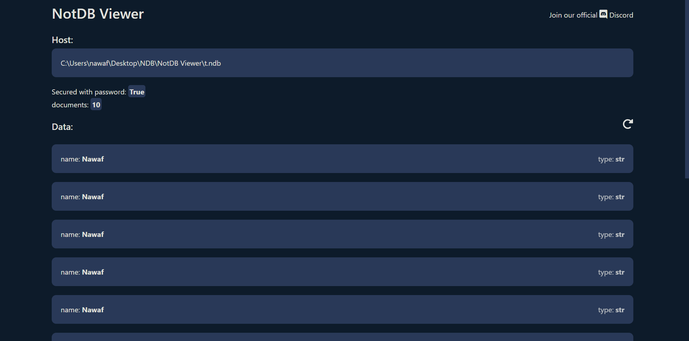

# NotDB
**NotDB** is an open source document-oriented database that uses [PYON](https://github.com/nawafalqari/pyon)-like documents

## Table of Contents
- [Installation](#installation)
- [Quick Start](#quick-start)
- [How to use](#how-to-use)
    - [DB Info](#db-info)
    - [get And getOne](#get-getone)
    - [appendOne And appendMany](#appendone-appendmany)
    - [removeOne And appendMany](#removeone-removemany)
    - [updateOne And updateMany](#updateone-updatemany)
- [View Your Data](#view-your-data)
- [Links](#links)


## Installation
#### PIP
```
pip install notdb
```

## Quick Start
First create your db file
```
notdb [dbname]
```
if you want to secure your db with a password you can use the `--password` or `-p` flag
```
notdb [dbname] --password
```
it will ask you for the password
```python
import notdb

db = notdb.NotDBClient('[dbname]') # replace [dbname] with your database name

db.get({}) # will return every document
```

## How To Use
### DB Info
```python
db.documents # will return number of documents in the database
db.host # will return db host (path)
```
### `get`, `getOne`
```python
db.get({'admin': True}) # will return a list of documents that match the filter
db.getOne({'admin': True}) # will return the "first" element that match the filter
```
### `appendOne`, `appendMany`
```python
db.appendMany([{'name': 'Nawaf'} for i in range(10)])
# this will append "{'name': 'Nawaf'}" to the database 10 times

db.appendOne({'name': 'Nawaf'})
# this will append "{'name': 'Nawaf'}" to the database 1 time
```
### `removeOne`, `removeMany`
```python
db.appendMany([{'name': 'Nawaf'} for i in range(10)])
# appending "{'name': 'Nawaf'}" 10 times

db.removeOne({'name': 'Nawaf'})
# this will just remove the first "{'name': 'Nawaf'}"

print(db.documents) # 9
```
```python
db.appendMany([{'name': 'Nawaf'} for i in range(10)])
# appending "{'name': 'Nawaf'}" 10 times

db.removeMany({'name': 'Nawaf'})
# This will remove every "{'name': 'Nawaf'}" in the database

db.removeMany({})
# This will remove every thing from the database
```
### `updateOne`, `updateMany`
NotDB have 2 types of updates `SET` and `UNSET`

<small>I will add more in the future😅</small>

```python
db.appendOne({'name': 'Nawaf'})
# adding "{'name': 'Nawaf'}" to the db

# first parameter is "_filter" -> which document you are trying to edit
# second parameter is "update" -> what key you are trying to SET/UNSET
# last parameter is "type"     -> update type: SET or UNSET
db.updateOne({'name': 'Nawaf'}, {
   'age': 15
}, notdb.SET)
# Easy, right?

db.updateOne({'name': 'Nawaf'}, {
   'programmingLangs': ['Python', 'JavaScript', 'C++']
}, notdb.SET)
```
```python
db.updateMany() # is still under development
```

## View Your Data
Best way to see your db data is by using [notdb_viewer](https://github.com/nawafalqari/NotDB_Viewer)

* [NotDB Viewer Docs](https://github.com/nawafalqari/NotDB_Viewer#readme)



## Links
* [Discord](https://discord.gg/Az8McWNAcg)
* [Twitter](https://twitter.com/nawafalqari2)