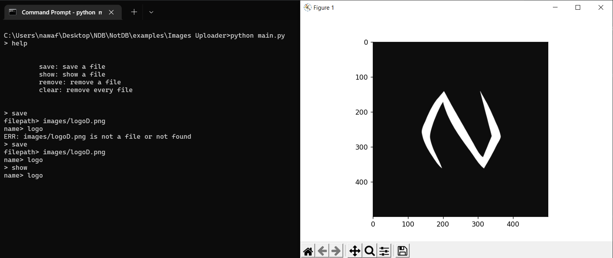

# Images Uploader

When you run `main.py`
an `input` will show up

there are 3 commands

```
python main.py

> help


         save: save a file
         show: show a file
         remove: remove a file
         clear: remove every file


>
```

